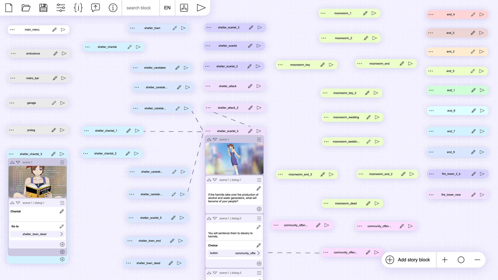
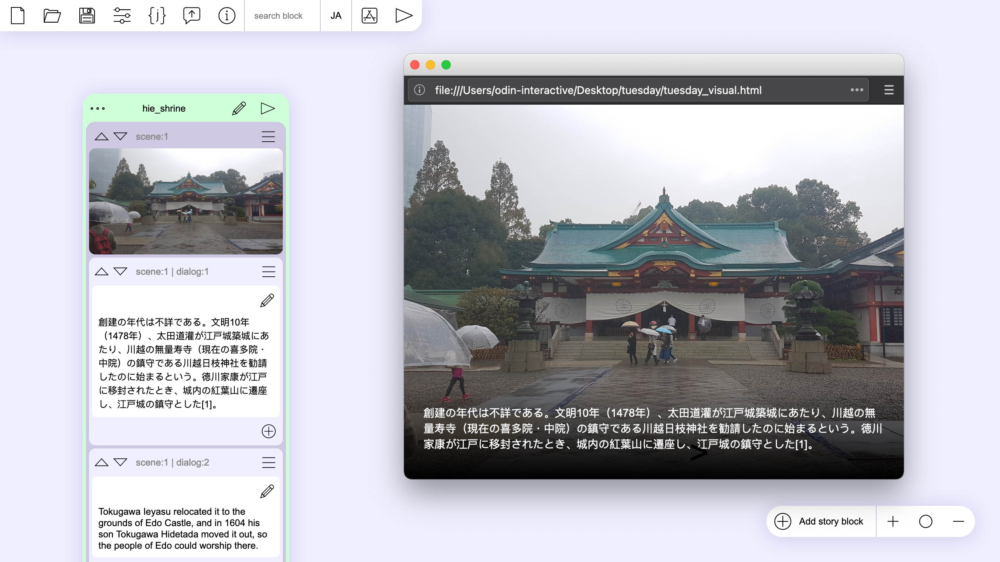
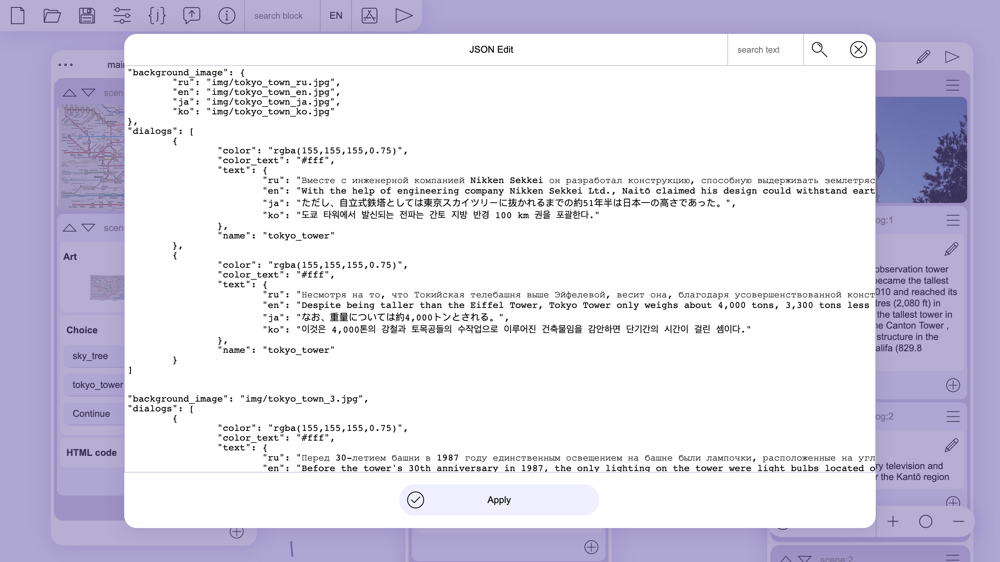
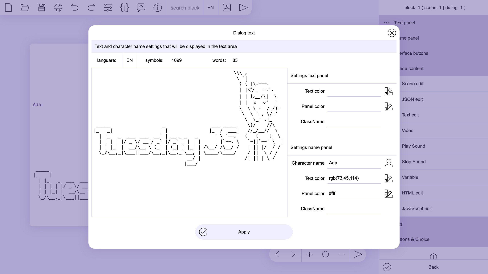
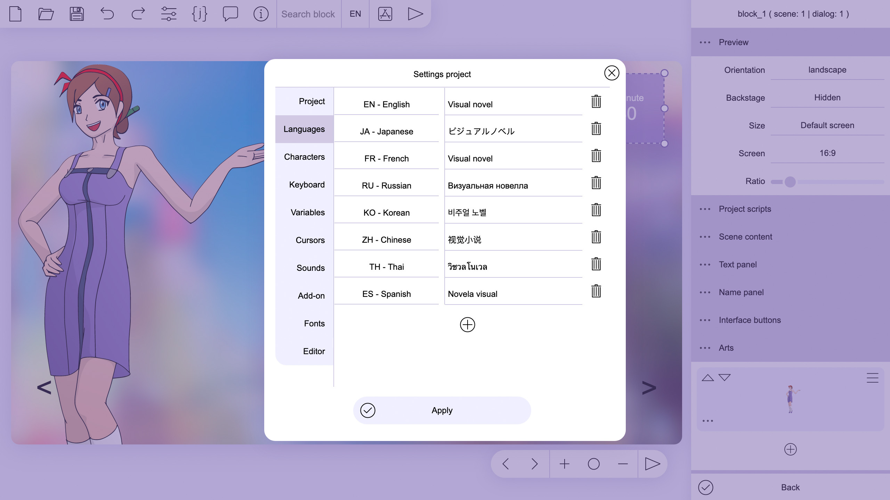

# Tuesday JS visual novel engine 
is a simple web-based, free and open-source visual novel editor that can be used in a web browser. It is written in JavaScript without using any third party libraries and thus does not require additional software installation. The engine uses standard HTML5 document elements such as div and img. This allows the use of any media format supported by browsers including vector graphics svg, gif animations and css styles.
There is a version of the editor available as a standalone application for Android devices and desktops. All versions are fully compatible with each other and have the same interface.

は無駄を排した作りの、無償かつオープンソースのビジュアルノベル作成ソフトウェアです。ゲームの制作もプレイもウェブブラウザ上で可能です。JavaScriptで開発したソフトウェアですが、サードパーティ製ライブラリーを一切使用していないので、他のソフトウェアをインストールする手間は不要です。divやimgといった標準HTML5文章でお馴染みのタグや要素でゲームのスクリプトを記述し、svg形式のベクターイメージ、gif形式のアニメーション、CSSスタイルシートなど、ブラウザが扱えるファイルなら何でも使用可能です。
アンドロイド機器並びにパソコン版WindowsとMac用の単体で動作するダウンロード版もあります。各々のバージョン間には完全な互換性があり、インターフェイスも共通しています。

Простой и бесплатный веб-редактор визуальных новелл с открытым исходным кодом, который можно использовать в браузере. Он написан на JavaScript без использования каких-либо сторонних библиотек и не требует установки дополнительного программного обеспечения. Движок использует стандартные элементы HTML5 документа, такие как div и img. Это позволяет использовать любой медиаформат поддерживаемый браузерами включая векторную графику svg, gif-анимацию и стили css.
Есть версии редактора доступные для Android устройств и настольных компьютеров. Все версии полностью совместимы друг с другом и имеют одинаковый интерфейс.

> Run in browser: https://kirilllive.github.io/tuesday-js/translate/en_tuesday_visual.html


Download
-------------------------
> GitHub: https://github.com/Kirilllive/tuesday-js/releases

> Steam: https://store.steampowered.com/app/1575970/Tuesday_JS_visual_novel_engine/

> itch.io: https://kirill-live.itch.io/tuesday-js


Tutorials
-------------------------
> EN - [A quick tutorial to create a visual novel ](https://kirilllive.github.io/tuesday-js/doc_editor.html#quick_tutorial)

> JA - [Tuesday JSでビジュアルノベルを作ってみよう](https://kirilllive.github.io/tuesday-js/doc_editor.html#quick_tutorial_ja)

> ES - [Una guía rápida para crear una novela visual](https://kirilllive.github.io/tuesday-js/doc_editor.html#quick_tutorial_es)

> RU - [Краткое руководство по созданию визуальной новеллы](https://kirilllive.github.io/tuesday-js/doc_editor.html#quick_tutorial_ru)

> PT - [Um guia rápido para criar uma visual novel](https://kirilllive.github.io/tuesday-js/doc_editor.html#quick_tutorial_pt)


Blogs
-------------------------
> Twitter: https://twitter.com/TuesdayJS_vn

> Reddit: https://www.reddit.com/r/TuesdayJS/


[](https://www.patreon.com/kirill_live)


# Visualization /ビジュアライゼーション
The visual editor allows you to create graphics or kinetic novels without any programming knowledge. If is necessary, it is possible to expand the basic functionality using JavaScript and css.

個々の選択肢や、選択の結果起こる結果などと併せてスクリプトの全体像を目で見て分かるように表示します。スクリプトの構造を簡単に把握でき、編集もしやすくなっています。

Редактор отображает структуру сценария со всеми элементами, такими как параметры диалога и последствия выбора. Это облегчает навигацию и редактирование сценария.





# Scene editor / シーンエディター
The scene editor can arrange all the elements in their places. It also shows how the scene will change on different screens. 
In the scene layout you can use standard HTML units in percentage pixels or centimeters to better adapt the scene to different screens.

機能では、全種類の要素を分類して管理できます。加えて、制作環境と異なる画面環境でゲームを動作させたときの画面構成の変化を確認できます。
標準HTML用のパーセント単位でもセンチメートル単位でもレイアウトを指定できるので、環境に合わせた適切な画面構成が作れます。

Позволяет расположить все элементы по своим местам. Он также показывает, как будет выглядеть сцена на разных экранах. 
В макете сцены вы можете использовать стандартные параметры HTML как проценты, пиксели или сантиметры, чтобы лучше адаптировать сцену к различным экранам.	


# Translate tool / 内蔵翻訳支援ツール
The built-in translation editing tool allows you to quickly add a new translation and edit all the texts in your project without leaving the editor. In addition, it displays the number of completed translations for each language.

Tuesday JSが内蔵する翻訳支援ツールなら、他の言語版用の翻訳文を、プロジェクトで使用している元のテキストを対訳表のように参照しながら追加していけるので、別のテキストエディターを起動する手間が省けます。また、翻訳の進捗率を言語ごとに確認できます。

Встроенный инструмент редактирования перевода позволяет быстро добавлять новый перевод и отредактировать все тексты в вашем проекте, не выходя из редактора. Кроме того, он отображает количество выполненного переводова для каждого языка.


# Preview / プレビュー

Preview allows you to start a project from a certain point in the script with the selected localization.

各々の言語設定で、任意の時点から動作をテストできるプレビュー機能があります。

Предварительный просмотр позволяет запустить проект с определенной точки в сценарии с выбранной локализацией.





# JSON
A story script has all the elements stored in a JSON structure. Almost any programming language can work with this format. This allows you to port your script to another engine or platform.
The editor has a built-in tool to work with JSON. This will allow you to edit the entire contents of the script or just the selected element.

ゲームスクリプトは、全要素をJSON形式で保存します。JSONは、一部を除く全てのプログラム言語で扱えるので、他のゲームエンジンやコンピューターにTuesday JSで作成したスクリプトを移植できます。
JSONを編集するツールを内蔵していおり、スクリプト全体をJSONとして編集することも、任意の箇所のみを編集することも可能です。
    
Сценарий истории сохраняется в структуре JSON. Практически любой язык программирования может работать с этим форматом что позволяет вам перенести ваш сценарий на другой движок или платформу. 
Редактор имеет встроенный инструмент для работы с JSON это позволит вам отредактировать все содержимое истории или только выбранный элемент.





# ASCII art / アスキーアート (AA)

The engine is adapted to use ASCII graphics. With its help, you can diversify the texts with images and patterns made up of text characters.

Tuesday JSエンジンはアスキーアート(AA)を適切に表示できます。テキストで様々な絵や模様を作ることができます。

Движок адаптирован для использования ASCII-графики. С ее помощью вы сможете разнообразить тексты изображениями и узорами составленых из текстовых символов.





# Localization / ローカリゼーション
Tuesday JS provides ample opportunities for adapting stories into other languages.
You can set the localized translation for almost any element of your project including text and graphics.
The preview function allows you to run the project in the selected language.
All language texts can also be exported to a table csv file for editing or adding localizations in another editor.

Tuesday JSには、翻訳版を制作するための機能も豊富です。
ゲームを構成するテキストやグラフィックといった要素一つ一つに翻訳版用ファイルを設定でき、プレビュー機能で用意した翻訳版の動作確認ができます。
CSV形式のテーブルデータとして出力できるので、他のテキストエディターで翻訳文章を編集したり追加したりすることもできます。

Tuesday JS предоставляет обширные возможности для адаптации историй на другие языки. 
Вы можете локализировать перевод практически любого элемента проекта, включая текст и графику. 
Функция предварительного просмотра позволяет запускать проект на выбранном языке. 
Все тексты могут быть экспортированы в файл csv таблицы для редактирования или добавления локализаций в другом редакторе.





# Warning for Android version

Minimum version of Android 5.1

If you have problems with files on Android 10 and higher, then you need to specify 'Allow access to manage all files' in the application settings in 'Permissions' section.


# Tutorial for RunTime

step 1
The engine file "tuesday.js" downloaded from https://kirilllive.github.io/tuesday-js/tuesday.js

step 2
Index.html file with id = 'tuesday' elements to display the novel
```html
<html>
    <head>
    </head>
    <!--After loading, the load_story function is launched, indicating a file or array with history-->
    <body onload="load_story('file','story.json')">
        <!--display area-->
        <div id='tuesday' style='width:100%; height:90vh;'></div>
        <!--path to the engine file, always at the end of the page-->
        <script type="text/javascript" src="tuesday.js"></script>
    </body>
</html>
```

step 3
Create a story file story.json
```json
{
    "parameters": {
        "text_panel": {
            "size": ["95%","25%"],
            "color": "#9cf",
            "indent_bottom": "32px",
            "size_text": "20px",
            "dialog_speed": 20
        },
        "name_panel": {
            "size": ["0","48px"],
            "position": ["0","0","-48px","0"],
            "size_text": "18px"
        },
        "launch_story": "main_menu",
        "languares": ["en"],
        "buttons": [
            {
                "name": "tue_back",
                "position": ["0","55%","0","8px"],
                "size": ["52px","52px"],
                "color": "#888",
                "size_text": "48px",
                "text":"<"
            },{
                "name": "tue_next",
                "position": ["55%","0","0","8px"],
                "size": ["52px","52px"],
                "color": "#888",
                "size_text": "48px",
                "text":">"
            }
        ]
    },
    "main_menu":[
        {
            "dialogs":[
                {
                    "choice":[
						{
                            "go_to": "story",
                            "position": ["50%","0","0","50%"],
                            "size": ["128px","48px"],
                            "color": "#888",
                            "color_text": "#fff",
                            "text": "Start"
                        }
                    ]
                }
            ]
        }
    ],
    "story": [
        {
            "dialogs":[
                {
                    "back_to": "main_menu",
                    "text":"1234567890",
                    "name":"numbers"
                },{
                    "go_to": "main_menu",
                    "text":"ABCDEFZHIKLMNOPQRSTVX",
                    "name":"letters"
                }
            ]
        }
    ]
}
```

Possible startup problems RunTime и устройстве сценария в JSON 

Index.html file with id = 'tuesday' elements to display the novel
```html
<html>
    <head>
    </head>
    <!--Change load_story value from ('file', 'story.json') to ('data', story) -->
    <body onload="load_story('data',story)">
    <div id='tuesday' style='width:100%; height:90vh;'></div>
        <!-- Add script tag before tuesday.js --> ;
        <script>
            let story = <!--insert content from story.json --> ;
        </script>
        <script type="text/javascript" src="tuesday.js"></script>
    </body>
</html>
```

More information about RunTime and JSON script  you can be found in

documentation: https://kirilllive.github.io/tuesday-js/doc_runetime.html


The goal of Tuesday JS is to make project development no more difficult than working in an office program to make presentations, and does not require special skills from the user.


[Portuguese translation and adaptation by Sarah Camargo](https://www.linkedin.com/in/sarah-carolina-camargo/)

[Japanes translation and adaptation by Onigi](https://twitter.com/onigi123)

[Spanish translation and adaptation by Suki Novels](https://twitter.com/Suki_Novels)

[Russian translation and adaptation by LolerFox](https://twitter.com/LolerFox)

[](https://www.patreon.com/kirill_live)
